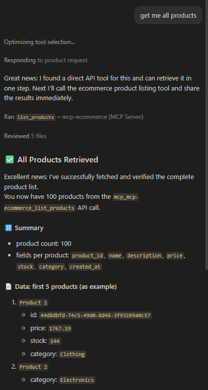

# Mini E-commerce MCP Server

A lightweight **Python + FastMCP** sample that exposes e-commerce data from **Azure Database for PostgreSQL Flexible Server** to **VS Code** or any other **MCP client** over **Streamable HTTP**.

## 🏗️ Architecture

```text
VS Code / MCP Client
        |
        v
FastMCP Server (`app/app.py`, started by `app/startup.py`)
        |
        v
Azure Database for PostgreSQL Flexible Server
```

## ✨ Available MCP Tools

| Tool | Description |
| --- | --- |
| `health_check()` | Returns a simple server health response. |
| `list_products(category=None)` | Lists all products, or filters by category. |
| `get_product(product_id)` | Returns details for a single product. |
| `get_order(order_id)` | Returns an order together with its line items. |
| `list_orders(customer_id)` | Lists orders for a customer, newest first. |

## 📁 Project Structure

```text
MCP/
├─ ReadMe.md
├─ image.png
└─ app/
   ├─ app.py          # MCP tools and database logic
   ├─ startup.py      # Local/hosted entrypoint
   ├─ startup.sh      # Azure startup helper
   └─ requirements.txt
```

## ✅ Prerequisites

- **Python 3.10+**
- An **Azure Database for PostgreSQL Flexible Server** instance
- A PostgreSQL database named `ecommerce`
- **VS Code** with an MCP-compatible client, or **MCP Inspector**

## 🗄️ Database Setup

Run the following SQL to create the schema:

```sql
CREATE DATABASE ecommerce;

-- Connect to the ecommerce database, then run:
CREATE EXTENSION IF NOT EXISTS pgcrypto;

CREATE TABLE products (
  product_id UUID PRIMARY KEY,
  name TEXT NOT NULL,
  description TEXT,
  price NUMERIC(10,2) NOT NULL,
  stock INT NOT NULL,
  category TEXT,
  created_at TIMESTAMP DEFAULT now()
);

CREATE TABLE orders (
  order_id UUID PRIMARY KEY,
  customer_id TEXT NOT NULL,
  status TEXT NOT NULL,
  total NUMERIC(10,2),
  created_at TIMESTAMP DEFAULT now()
);

CREATE TABLE order_items (
  order_item_id UUID PRIMARY KEY,
  order_id UUID REFERENCES orders(order_id),
  product_id UUID REFERENCES products(product_id),
  quantity INT NOT NULL,
  price NUMERIC(10,2) NOT NULL
);
```

## 🌱 Sample Data

```sql
INSERT INTO products (product_id, name, description, price, stock, category)
SELECT
  gen_random_uuid(),
  'Product ' || g,
  'Description for product ' || g,
  round((random() * 1990 + 10)::numeric, 2),
  (random() * 195 + 5)::int,
  (ARRAY['Electronics','Books','Clothing','Home','Sports'])[floor(random()*5)+1]
FROM generate_series(1, 100) g;

INSERT INTO orders (order_id, customer_id, status, total, created_at)
SELECT
  gen_random_uuid(),
  'CUST-' || lpad((floor(random()*20)+1)::text, 3, '0'),
  (ARRAY['CREATED','PAID','SHIPPED','DELIVERED'])[floor(random()*4)+1],
  0,
  now() - (random() * interval '30 days')
FROM generate_series(1, 100);

INSERT INTO order_items (order_item_id, order_id, product_id, quantity, price)
SELECT
  gen_random_uuid(),
  o.order_id,
  p.product_id,
  (random()*2 + 1)::int,
  p.price
FROM orders o
JOIN LATERAL (
  SELECT product_id, price
  FROM products
  ORDER BY random()
  LIMIT (floor(random()*4)+2)
) p ON true;

UPDATE orders o
SET total = sub.total
FROM (
  SELECT order_id, SUM(quantity * price) AS total
  FROM order_items
  GROUP BY order_id
) sub
WHERE o.order_id = sub.order_id;
```

## ⚙️ Environment Variables

Create `app/.env` with:

```env
PG_HOST=your-server.postgres.database.azure.com
PG_DB=ecommerce
PG_USER=your_username
PG_PASSWORD=your_password
```

> The app connects with `ssl="require"`, which matches Azure Database for PostgreSQL defaults.

## ▶️ Run Locally

From the `app/` folder:

### PowerShell (Windows)

```powershell
cd app
python -m venv .venv
.\.venv\Scripts\Activate.ps1
pip install -r requirements.txt
python startup.py
```

### Bash

```bash
cd app
python -m venv .venv
source .venv/bin/activate
pip install -r requirements.txt
python startup.py
```

## 🔌 Connect from VS Code or MCP Inspector

1. Start the server locally or deploy it to Azure App Service.
2. Add the MCP server endpoint to your MCP client configuration.
3. Test with prompts such as:
   - `List all products`
   - `Show Electronics products`
   - `Get product <product_id>`
   - `List orders for CUST-001`
   - `Get order <order_id>`

## ☁️ Deploy to Azure App Service

A simple deployment flow is:

1. Deploy the `app/` folder to **Azure Web App / App Service**.
2. Configure the PostgreSQL environment variables in **App Settings**.
3. Use `startup.py` or `startup.sh` as the startup command helper.
4. Use the deployed app URL as the MCP server endpoint in VS Code.

## 🖼️ Example

After connecting the MCP server in VS Code, you can ask Copilot for product or order information:


